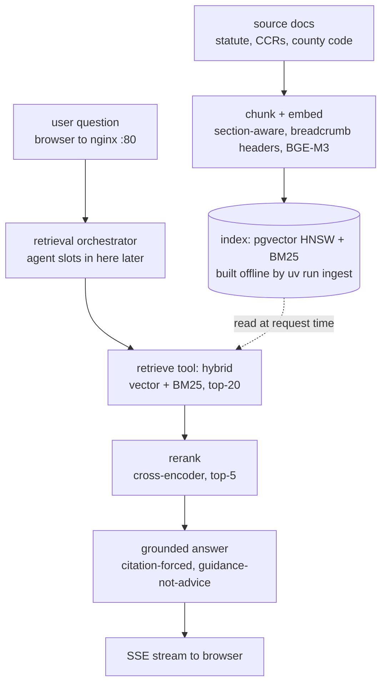

# Architecture overview

## Objective

Give Maryland homeowners and HOA members plain-language *guidance* on what the law and their governing documents say about a proposed action — surfacing the relevant policy and an exact citation rather than issuing a legal ruling.

---

## Background

Homeowners routinely face questions with a legal answer buried in three overlapping places: **Maryland statute** (the Homeowners Association Act and Maryland Condominium Act in the Real Property Article), **their own HOA's recorded covenants (CC&Rs) and bylaws**, and **county/municipal code**. The information exists and is public, but it is unindexed for a layperson: you cannot search "can they fine me for a fence" and land on the controlling section. The current alternatives are paying a lawyer for a question that is often answerable from the text, or guessing.

The failure this project addresses is an **information-retrieval and trust problem**, not a generation problem. A generic chatbot will confidently *answer* — "no, they can't fine you" — which is exactly the wrong behavior: it manufactures legal advice, it can hallucinate a nonexistent rule, and it strips the citation the user actually needs to act. The hard part is retrieving the *right* passage (legal text is dense with exact tokens — `§11B-111`, "architectural review committee," specific dollar caps) and then **forcing the model to ground every statement in a retrieved citation** and to frame output as informational.

**Pillar this optimizes for (KB §0.5): Reliability**, specifically *faithfulness* — the answer must be grounded in retrieved source or the system must say it doesn't know. It knowingly trades **Performance** (hybrid retrieval + reranking + citation-forcing is slower than a bare LLM call) and accepts modest **Cost** for eval tooling. It is emphatically not optimizing for scale — this is a low-QPS advisory tool.

---

## Related documents

- **Pattern reference:** `software-architecture-patterns-knowledge-base.md`
- **RAG stage reference:** `cloud-ai-platforms-comparison-knowledge-base.md` §Pattern 3 (RAG two-pipeline shape); `puffypenguin_interview_prep2.pdf` §7 (full RAG pipeline).
- **Structural prior art:** AgentRadar / finradar repos — uv workspace monorepo, single nginx port, docker-compose data plane, marker-gated pytest.
- **Retrieval technique source:** r/LangChain thread on language-specific RAG — the transferable levers are hybrid (BM25 + dense), contextual chunk headers, and reranking.
- **Reference implementation (skeleton):** Sean Chen, "RAG AI Agent Design & Launch in 35 Min" (`youtube.com/watch?v=ZREt9MAozho`), code at `github.com/ShenSeanChen/launch-rag`. A FastAPI + pgvector (via Supabase) RAG backend with citation-tracked answers, Dockerized to Cloud Run. This project borrows its shape — FastAPI, pgvector, citation-in-response, `/seed` + `/answer` endpoints, Docker — and deliberately diverges on four points: (1) **self-hosted dockerized pgvector** vs Supabase-hosted; (2) **local BGE-M3 embeddings** vs OpenAI `text-embedding-3-large`; (3) **hybrid retrieval + rerank** vs pure vector similarity; (4) **guidance-not-verdict + relevance-floor refusal + SSE streaming** vs always-answer JSON. Note the reference, despite the "agent" name, is **classic one-shot RAG** (retrieve-then-generate, no decision loop) — which matches this design's v1 rung (see Architecture · A and the Non-goal on agentic reasoning).

---

## Goals

- A homeowner gets **guidance + the governing rule + an exact citation** for a housing/HOA question, in plain language.
- Every substantive claim in an answer is **traceable to a retrieved chunk**; unsupported questions get "I can't find this in the sources" rather than a guess.
- Output is consistently framed as **informational, not legal advice**, with a standing disclaimer.
- The corpus is **re-ingestible** — when a statute is amended, re-running ingestion updates the index without a full rebuild.
- Runs entirely **self-hosted / dockerized** with no per-token API dependency for embeddings or reranking.

---

## Non-goals

- **Giving a legal ruling or a "yes/no you're allowed" verdict** — out of scope by design; that's practicing law and creates liability. The system points at policy.
- **Real-time monitoring for law changes** — out of scope; statute changes slowly, ingestion is run on demand. (This is why it's not "radar.")
- **Case law / court opinions** — v1 is statute + governing docs + county code only; case law retrieval is a v2 corpus expansion.
- **Multi-state coverage** — Maryland only for v1; the `jurisdiction` metadata field leaves the seam open.
- **User accounts uploading their own private CC&Rs** — v1 ships with a curated public corpus; per-user document ingestion is v2 (adds a whole auth/tenancy surface).
- **Agentic multi-hop reasoning** — v1 is classic one-shot RAG. Per KB §1.4, don't skip rungs; add agency only where eval shows one-shot retrieval failing.

---

## Glossary

- **CC&Rs:** Covenants, Conditions & Restrictions — the recorded rulebook a specific HOA enforces. Sits *below* statute; statute overrides a conflicting covenant.
- **Contextual chunk header:** a breadcrumb (e.g. `[MD HOA Act › §11B-111 › Meetings — Notice]`) prepended to each chunk before embedding, so both retrieval and the LLM see where a passage sits in the document hierarchy.
- **Hybrid retrieval:** BM25 (lexical/keyword) + dense (semantic vector) run together and fused. BM25 catches exact section numbers and defined terms; dense catches paraphrase.
- **Reranking:** a cross-encoder (BGE-reranker) re-scores the top-k candidates from hybrid retrieval; the single biggest quality lever per the interview-prep RAG doc.
- **Faithfulness:** the eval metric for "is the answer grounded in the retrieved context, or did the model make it up?" (KB §0.9.5 / RAG triad).
- **SSE:** Server-Sent Events — one-way streaming from FastAPI to the browser, used to stream tokens and citations as they're produced.

---

## Scenarios

**Scenario: answerable question with a clean citation**
1. User types "Can my HOA stop me from installing solar panels?"
2. Query is embedded (BGE-M3) and run through BM25 in parallel; hybrid fusion returns top-20 candidate chunks filtered to `jurisdiction=MD`.
3. BGE-reranker re-scores; top-5 pass to the LLM as XML-tagged context, each carrying its breadcrumb header and citation.
4. LLM streams (SSE) a plain-language summary of the rule, notes Maryland limits an HOA's ability to prohibit solar, and cites the controlling Real Property section — framed as "here's what the law says," not "you're allowed."
5. UI renders the streamed answer with the citation as a clickable source card, plus the standing "informational, not legal advice" banner.

**Scenario: question the corpus can't support**
1. User asks about a niche tax-lien interaction not in the ingested corpus.
2. Hybrid retrieval + rerank return only low-score chunks (below the relevance floor).
3. The generation prompt's grounding rule triggers: the model responds that it can't find governing policy for this in its sources and suggests consulting an attorney or the specific county office — it does **not** improvise a rule.

**Scenario: re-ingestion after an amendment**
1. Maintainer drops an updated statute PDF into the source folder and runs `uv run ingest`.
2. Ingestion parses → section-aware chunks with fresh breadcrumb headers → embeds → upserts into pgvector by stable content hash, replacing changed chunks only (delta update, not full rebuild).

---

## Architecture overview

### A. Complexity rung (KB §0.7)

**Chosen rung: Rung 2 — modular monolith**, deployed as a small set of docker-compose services (backend, db, frontend, nginx) but with the *application* code as one deployable split into internal packages (`ingestion`, `retrieval`, `api`, `core`).

**Why not the rung below (Rung 1, plain monolith):** the ingestion pipeline (offline, batch, heavy model loads) and the query API (online, latency-sensitive, SSE) have genuinely different runtime profiles and dependency footprints. Keeping them as separate packages with a shared `core` lets ingestion run as a one-shot container without dragging the web server's lifecycle around.

**Why not the rung above (Rung 3, service-oriented):** there's one owner and low QPS. Splitting retrieval and generation into separately deployed services would double operational complexity (network hops, independent deploys, distributed tracing across a boundary) to buy independence nobody needs yet. The package boundary is a seam I can cut later if retrieval ever needs to scale independently.

### B. Paradigm (KB §0.8)

**Primary paradigm: hybrid, organized as functional core, imperative shell (KB §0.8.4).**
**Rationale:** the retrieval and chunking logic is naturally pure — `chunk(document) -> list[Chunk]`, `fuse(bm25_hits, dense_hits) -> ranked`, `build_prompt(query, chunks) -> str` are all pure functions over immutable data, trivially unit-testable with no I/O. The imperative shell is thin: FastAPI handlers, the pgvector client, the model runtime. This is the same shape as the research-library-agent guide's "each node is a pure function over state, independently testable."

### C. Internal structure (KB §1, §1A)

**Internal structure: Layered, with vertical-slice packages.** Each package (`ingestion`, `retrieval`, `api`) is a feature slice; within each, a thin layer split (I/O adapter → service logic → pure functions). Not full hexagonal/DDD — the domain isn't complex enough to earn the ceremony (KB §1A.11 warns against hexagonal for simple shapes). The one port worth abstracting is the **embedder/reranker model interface**, so the same code runs against a local dockerized BGE and could later swap to an API without touching retrieval logic (the AgentRadar model-adapter pattern).

**Module boundaries:**
- `core` — pydantic models (`Chunk`, `Citation`, `RetrievalResult`), settings, the model-port protocol. No I/O.
- `ingestion` — parse → section-aware chunk (breadcrumb headers) → embed → upsert to pgvector + BM25 index.
- `retrieval` — hybrid fuse + rerank + prompt assembly.
- `api` — FastAPI, SSE endpoint, the grounding/guardrail prompt, disclaimer injection.

### D. Component patterns (KB §3–§8)

- **RAG two-pipeline (cloud-KB §Pattern 3):** offline ingestion pipeline builds the index; online query pipeline uses it. The core shape of the whole system.
- **Cache-Aside (KB §7.2):** cache `(query, jurisdiction) → reranked chunk IDs` and embedding results. Statute is near-static, so cache hit rate on repeat questions is high and the win is real.
- **Anti-Corruption Layer (KB §6.2) / model port:** the embedder+reranker sit behind one interface so local-vs-API is a config line, not a code change.
- **Rate Limiting (KB §5.x):** on the public query endpoint — an LLM endpoint with no limit is a cost-blowup waiting for a retry loop or abuse.
- **Retry with backoff + Timeout (KB §5.x):** around the model runtime calls.
- **API Gateway (KB §4) via nginx:** single port, `/api` → FastAPI, `/` → static frontend, SSE passthrough (buffering off).

---

## Diagrams

The index is the handoff point between two pipelines that run at different times. The **offline ingestion pipeline** builds the index ahead of time (`uv run ingest`, re-run only when a statute changes) — the user's question never flows through it. The **online request pipeline** hits the already-built index per request. The orchestration node marked "Retrieval orchestrator" is a fixed retrieve-then-generate step in v1 (classic RAG); it is also exactly where an **agent** would slot in later if eval shows one-shot retrieval failing (see Non-goals and Architecture · A). In the diagram below, the top chain (source docs → index) is the offline build; the bottom chain (question → SSE) is the online request path; the dotted edge is the request path reading the pre-built index.

**Editable source:** `docs/architecture.mermaid` in-repo.

---
