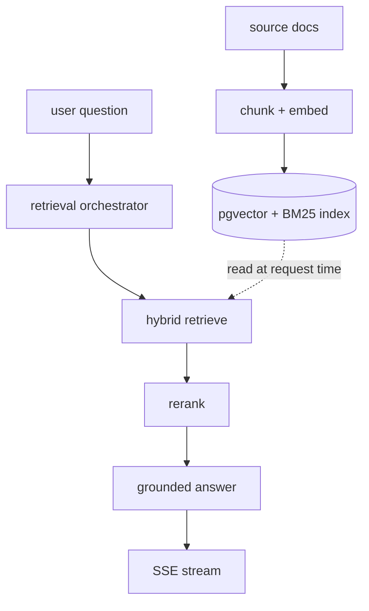

# MDHousingPolicyPipeline

Retrieval-grounded advisory over Maryland housing, HOA, and condominium law. Ask
a plain-language question ("can my HOA make me take down a fence?") and get
**guidance plus the governing policy and an exact citation** — deliberately *not*
a legal verdict.

The system points at the law rather than interpreting it: every answer is
grounded in a retrieved source with a forced citation, and unsupported questions
get "I can't find this in the sources" instead of a guess. That behavior is the
compliance boundary, not a UX preference.

## Where to go

- **[Architecture](architecture/overview.md)** — the full architecture and the
  reasoning behind each decision (retrieval, chunking, the guidance-not-verdict
  guardrail), split across focused pages.
- **[CLI reference](reference/cli.md)** — the `mdhpp` command.
- **[Packages](reference/packages/index.md)** — auto-generated API reference.

## Pipeline shape

Offline ingestion builds the index; the online request path queries it.

